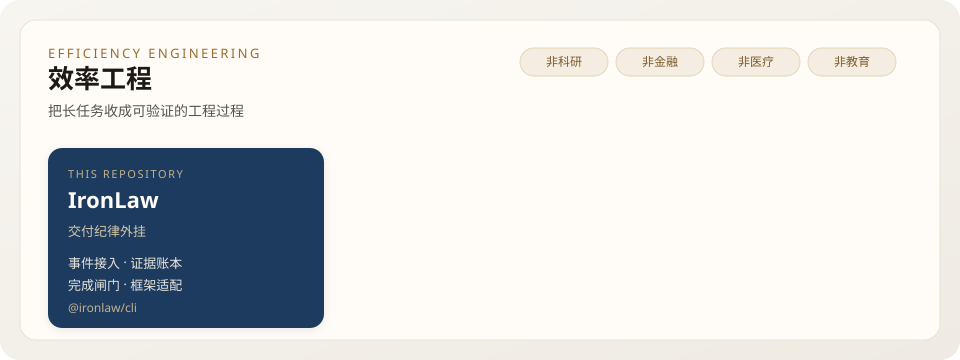
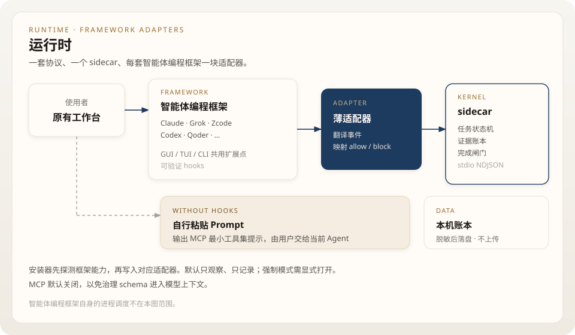

# IronLaw

A plugin and sidecar that keeps long agent-coding tasks honest: it records real events, keeps verifiable evidence, and blocks clearly dangerous actions. It is not a new coding assistant.

[](LICENSE)
[](https://nodejs.org)

## Why

Long tasks drift when nobody checks between turns.

- **Green test ≠ shipped.** Exit code 0 only means the command ended. It does not prove the requirement is covered, the path isn't mocked, the test isn't empty, the source wasn't edited again afterwards, or the artifact exists and starts.
- **Shortest path means rework.** Skipping constraints and the end-to-end journey now looks faster and costs more later.
- **Compaction and handoff drop the spec.** "I remember you wanted…" is not the original task.
- **Claims without events are just claims.** "Tests pass" or "build done" with no matching tool call, exit code, or file change proves nothing.
- **No end condition means endless edits.** Reporting done while the gap is unchanged is not progress.

IronLaw hangs outside the framework — at the points where tools run, files change, and sessions end — and writes facts to a sidecar the model cannot rewrite. Focus: less rework, less drift, no unverified "done".

IronLaw is one component of an efficiency-engineering effort whose scope is general work outside scientific research, finance, healthcare, and education.

<p align="center">
  
</p>

## What it is

| Part | Role |
|---|---|
| plugin | sits on a framework's hooks; observes and can block |
| sidecar | keeps task state, evidence ledger, and the completion gate |
| cli | installs, probes, and reports |

<p align="center">
  
</p>

## Install

```bash
npx @ironlaw/cli install
```

Auto-detects installed coding frameworks and installs the matching adapter. `--framework <name>` targets a single one when needed.

```bash
npx @ironlaw/cli doctor
npx @ironlaw/cli status
npx @ironlaw/cli uninstall
```

Data stays local (Windows `%LOCALAPPDATA%\IronLaw`, elsewhere `~/.cache/ironlaw`) and is redacted before it is written.

## What it does

| Symptom | Handling |
|---|---|
| spec lost after compaction | task contract + short anchor |
| "done" with no trail | records tool calls, exit codes, files, git |
| green test treated as shipped | completion gate by evidence grade |
| destructive or out-of-scope action | conservative pre-tool rules (enforcer mode) |
| keeps editing after reporting | bounded, conditional repair |

Default mode observes. Blocking and repair turn on with `IRONLAW_MODE=enforcer`. MCP stays off so governance tool schemas don't enter the model context.

## Frameworks

Frameworks with verifiable hooks get an adapter and a sidecar. Frameworks with only MCP or rules get a copy-paste prompt instead of an automatic install.

```text
For this task use the IronLaw MCP toolset:
1. il_status — current stage, goal, risk
2. il_check — check spec, changes, and reproducible evidence before claiming done
3. il_report — facts, evidence, open items, blockers
Never treat a green test, model self-report, or hand-written summary alone as done.
```

Adapter contract: [docs/framework-matrix.md](docs/framework-matrix.md). Scope: [docs/release-scope.md](docs/release-scope.md). Protocol: [protocol/README.md](protocol/README.md).

## Develop

```bash
npm test
```

Node.js 20+. No runtime dependencies.

## License

MIT. IronLaw is an independent component; it is not affiliated with any coding framework or model vendor.
